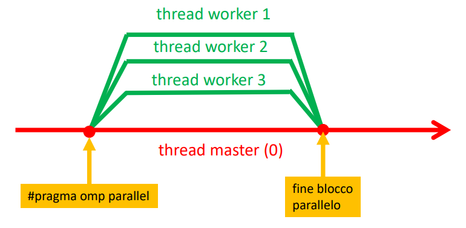

OpenMP = Open specifications for Multi-Processing

Libreria per programmazione parallela **su sistemi shared memory**

Direttive \# pragma omp

### Creazione di thread
\# pragma omp **parallel** [num thread(n)] [altre eventuali clausole] {
    ...
}

- Il blocco di istruzioni che segue la direttiva viene eseguito da un insieme di **thread paralleli**.
- In assenza di ulteriori indicazioni il numero di thread viene deciso dal sistema. 
    - Di solito: 1 thread/core disponibile
- Modello cobegin-coend puro
- **Sincronizzazione implicita**: al termine del blocco parallelo il **processo master** attende che tutti i workers siano terminati.
    - quando si generano dei thread, il processo master è quello che è presente prima e dopo il blocco parallelo

**Clausole**:

- **num_threads(n)**:
    - il numero di thread paralleli è N (compreso il master)
    - n può essere anche una variabile

- **shared, private, firstprivate**:
    - per specificare lo scope di visibilità di variabili

- **if**:
    - parallelizzazione condizionale

- **for**:
    - per la parallelizzazione di un ciclo

- **reduction**:
    - per specificare operazioni di reduce

- **schedule**:
    - per gestire la suddivisione del workload tra thread paralleli

### Scope delle variabili
Quali variabili sono condivise dai processi e quali private?

Default:
- ogni variabile definita **esternamente** a _# pragma omp parallel_ è **condivisa tra i thread paralleli**
- ogni variabile definita **internamente al blocco parallelo è locale al singolo thread**

**NB**: C’è la possibilità di specificare diversamente dal default con le clausole **_shared_**, **_private_**, **_firstprivate_**

Esempio:

    int a=1, b=1, c=1;
    #pragma omp parallel shared(a) private(b) firstprivate(c) {
        a++;
        b++;
        c++;
    }

a,b,c sarebbero shared (default), ma per effetto delle clausole:
- private(b): b è privata; ogni processo ne usa una istanza locale **non inizializzata**
- firstprivate(c): ogni processo usa una copia privata di c **inizializzata al valore che c aveva prima di \#pragma**
- shared(a): a è condivisa tra tutti i thread paralleli (è il default, la clausola è superflua)

### Mutua esclusione
L’accesso a variabili *shared* da parte di thread paralleli va sincronizzato: è necessario imporre la mutua esclusione.

A questo scopo è possibile usare la direttiva **critical**:
    \# pragma omp critical
        <sezione critica>

Il blocco di istruzioni immediatamente successivo alla direttiva viene eseguito da un solo processo alla volta.

**atomic**: 
se non è necessaria definire un'intera sezione critica ma solo di un'operazione atomica, questa direttiva migliora le performance.
- può usare istruzioni atomiche della CPU invece di lock
- blocca un thread solo se necessario e non sempre e comunque

es:
    #pragma omp parallel for
    for (int i=0; i <=LENGTH; i++) {
        #pragma omp atomic  // funziona anche critical 
        histogram_parallel[Vector[i]]++;
    }

- qua *atomic* blocca un thread, solamente se sta tentando di incrementare lo stesso indice di un altro
    - permette accesso concorrente quando i thread lavorano su indici diversi
- *critical* bloccherebbe sempre e comunque rendendo la parte di incremento di fatto sequenziale

### Sincronizzazione tra thread in OMP
Oltre alle clausole *critical* e *atomic* per la mutua esclusione, OMP offre altri strumenti per realizzare in modo esplicito la sincronizzazione tra thread paralleli:
- direttiva barrier: implementa la classica barriera di sincronizzazione in un team di threads.
- gestione di lock: tramite le funzioni *omp_set_lock* e *omp_unset_lock* è possibile realizzare schemi di sincronizzazione ad hoc tra threads.

### Reduction
Associa a un blocco parallelo una variabile condivisa <var> che viene utilizzata per memorizzare il risultato di un’operazione <op> di reduce:

    double ris; // non è importante inizializzarla
    \# pragma omp parallel ... reduction(+: ris) {
        ris+=Trap(a, b, n);
    } 

- L’espressione viene valutata in parallelo
- l’aggiornamento di <Var> avviene in mutua esclusione.

### Clausola if
E’ possibile condizionare la parallelizzazione al verificarsi di una condizione con la clausola if.

Esempio:
    int main( int argc, char *argv[] ) {
        t=atoi(argv[1]);
        
        #pragma omp parallel if (t > 10) num_threads(t)
        f();    //eseguita in parallelo da t threads, solo se argv[1]>10;
                //altrimenti pragma è ignorato (esecuzione seriale).
    }

### Direttiva master
    \# pragma omp master

Permette di far eseguire un blocco di istruzioni al thread Master (rank 0).

### Direttiva single
    \# pragma omp single

Fa eseguire un blocco di istruzioni ad uno solo tra i thread paralleli.
Quale? Scelta non deterministica

NB: realizza una **barriera di sincronizzazione implicita**: ogni thread, prima di eseguire **l’istruzione successiva al blocco single**, attende tutti i thread (compreso il single) abbiano terminato le istruzioni precedenti.

## Parallelizzazione di cicli
Moltro comune e importante poter parallelizzare i cicli

\#pragma omp parallel for [altre clausole..]
    <ciclo for di K iterazioni>

se *n* è il num di thread paralleli, ogni thread esegue un **blocco di *K/n* iterazioni contigue**

**es**:
#pragma omp parallel for num_threads(4)
    for(i=0; i<20; i++)
        v[i] = i*i;

- a ogni thread è assegnato un chunk di 5 iterazioni contigue.

### Distribuzione del carico
Non sempre la suddivisione a blocchi è quella ottimale. 
- E’ possibile che il **carico di iterazioni distinte sia diverso**

Ad esempio:

sum = 0.0;
for (i = 1; i <= n; i++)
    for (j=0; j<i; j++)
        sum += f(i);

considero il for esterno:
- la prima iterazione chiama f una volta
- la seconda iterazione chiama f due volte
- ...
- l’ultima iterazione (i=n) chiama la f *n* volte

**Una parallelizzazione a blocchi produrrebbe un carico sbilanciato**: 
- il primo thread lavora meno del secondo, che lavora meno del terzo. ecc.

E’ possibile ottenere **distribuzioni diverse attraverso la clausola schedule**.

### Clausola schedule

\#pragma omp parallel for schedule(<tipo>, <chunksize>)

Dove:
• <tipo> indica il tipo di distribuzione (esempio: static, dynamic)
• <chunksize> indica l’unità di carico (espressa in numero di iterazioni)

**static scheduling**:
prevede che la distribuzione del lavoro venga fatta assegnando i diversi chuncks ai thread «staticamente» secondo una politica **round-robin**.

Esempio:
#pragma omp for num_thread(4) schedule (static, 1)
    for(i=0; i<20; i++)
        v[i] = i*i;

Lo scheduler assegnerà (chunk di 1 iterazione):
- thread 0 le iterazioni 0, 4, 8, 12, 16
- thread 1 le iterazioni 1, 5, 9, 13, 17
- thread 2 le iterazioni 2, 6, 10, 14, 18
- thread 3 le iterazioni 3, 7, 11, 15, 19

comdo per distribuire il carico in modo bilanciato, **quando dipende in modo deterministico dal numero di iterazione**.

**dynamic scheduling**:
quando un thread termina l’elaborazione di un chunk, lo scheduler gli assegna il prossimo chunk (seguendo l’ordine degli indici)

Esempio:
#pragma omp for num_thread(4) schedule (dynamic, 2)
    for(i=0; i<20; i++)
        v[i] = i*i;

Inizialmente lo sheduler assegnerà chunk di dim 2 (analogamente al caso statico):
- thread 0 le iterazioni 0,1
- thread 1 le iterazioni 2,3
- thread 2 le iterazioni 4,5
- thread 3 le iterazioni 6,7

Successivamente:
- **Al primo thread che termina il suo primo chunk verrà assegnato il chunk 8,9**
- Al successivo thread che termina il suo primo chunk verrà assegnato il chunk 10,11
- ...

**NB**: in questo modo è possibile mantenere il carico bilanciato, anche in presenza di non determinismo nel numero di operazioni da eseguire ad ogni iterazione
- se un'iterazione è pesante, al thread a cui è stata assegnata non verrano assegnati altri chunck per un po'

### Misurazione del tempo

double omp_get_wtime(void);

restituisce il tempo (**in secondi**) trascorso da un certo istante iniziale (fissato dal sistema). («wallclock»)