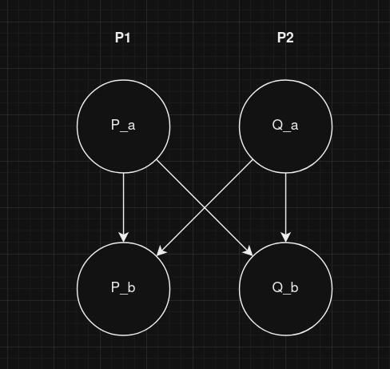

### Proprietà che un programma che fa uso di semafori rispetta sempre
Dato un semaforo S, siano:
- vals: valore dell’intero non negativo associato al semaforo;
- Is: valore intero≥0 con cui il semaforo s viene inizializzato;
- nvs: numero di volte che l’operazione V(s) è stata eseguita;
- nps: numero di volte che l’operazione P(s) è stata completata.
Allora:

    Relazione di invarianza: in qualunque istante nps è sempre <= di is + nvs
        -> proprietà safety (sempre vera)

Possiamo sfruttare questa relazione per dimostrare formalmente le proprietà dei programmi concorrenti che usano i semafori

IL SEMAFORO NON é UNO STRUMENTO UTILIZZATO SOLAMENTE PER LA MUTUA ESCLUSIONE (STRUMENTO GENERALE PER QUALSIASI ESIGENZA DI SINCRONIZZAZIONE)

Dimostrazione della mutua esclusione
...
c) questo requisito dice in un altro modo che non si può stabilire un ordine di accesso alla sezione critica

## VARI TEMPLATE PER L'UTILIZZO DI SEMAFORI

__NB__: in generale l'accesso al gestore va reso mutamente esclusivo, uso di semaforo mutex

...

### Mutua esclusione tra gruppi di processi
...
quando voglio "leggere" lo stato della risorsa, ma non modificarlo, non c'è bisogno di mutua esclusione. Però voglio anche garantire mutua esclusione tra operazioni diverse.

...
esempio lettori/scrittori

### implementazione dei vincoli di precedenza di un programma concorrente mediante semafori evento

### rendez-vous

due semafori evento, uno per processo da sincronizzare

### generalizzazione del rendez-vous
non sappiamo a runtime quanti processi concorrenti saranno presenti, di conseguenza non sappiamo neanche quanti semafori usare

soluzione: barriera di sincronizzazione 

    barriera inizializzata a 0
    ...
    sincronizzazione a tornello, il precedente risveglia il successivo

__NB__: questa è un'esigenza frequente. N processi devono aspettarsi prima di proseguire in una fase successiva.

### SEMAFORI BINARI COMPOSTI: Scambio di dati
non solo sincronizzazione ma anche sincronizzazione in funzione della comunicazione.

    vu attesa del produttore
    pn attesa del consumatore

Semaforo binario composto, può essere generalizzato a n processi.

In generale questo tipo di semaforo mi serve a dare un __ordine nell'accesso ad una risorsa condivisa__  (al contrario della mutua esclusione)

### SEMAFORO CONDIZIONE
...
S2 = statement che può portare la condizione C a vero

- attesa circolare
    - while molto importante
    - il processo risvegliante non necessariamente imposta la condizione a vera
    - potrebbero esserci molti processi in attesa e non si sa chi viene risvegliato per primo. Essi possono riportare la condizione 
    a false
- passaggio del testimone 
    - risveglia un unico processo in quanto è solo quello che mantiene la mutua esclusione

### SEMAFORO RISORSA
semaforo utilizzato per la gestione di un pool di N risorse equivalenti

...

### SEMAFORE PRIVATO
possiamo avere si che i processi richiedenti abbiano delle condizione di accesso alla risorsa condivisa basate su proprietà non solamente della risorsa stessa ma anche del singolo processo (i.e. priorità di un processo)

nel momento in cui si creano le condizioni di risveglio si deve avere modo di selezionare quale dei tanti processi risvegliare in base a queste caratteristiche private

