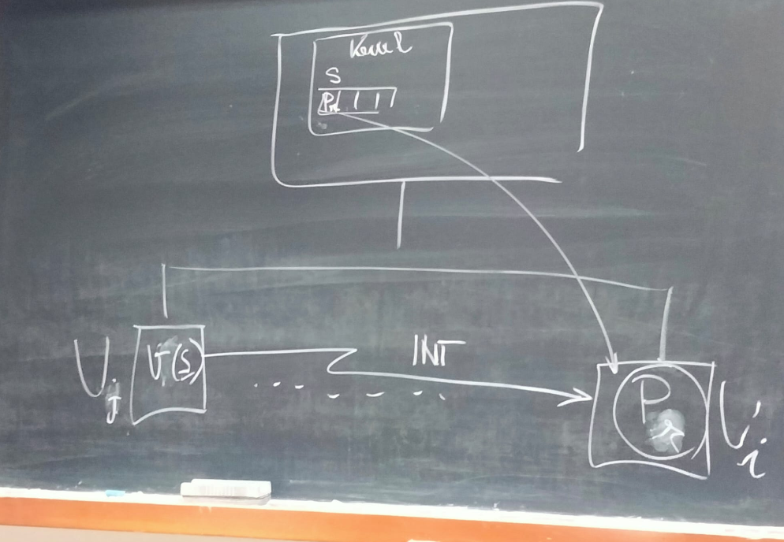

U_n = unità di elaborazione indipendenti
    M_n     = memoria privata
    I/O_n   = unità di I/O privata

Due modelli:
    
#### Modello SMP(Simmetric Multi Processing)
__Unica copia del nucleo condivisa tra tutte le CPU allocata nella memoria comune__ che si occupa della gestione di tutte le risorse disponibili, comprese le CPU.

Caratteristiche:
- Ogni processo può essere __allocato su una qualunque CPU__
    - possibilità di politiche di bilanciamento di carico
    - più spesso si schedula un processo sul processare in cui stava eseguendo precedentemente in quanto quel processore ha già la sua memoria privata e le sue cache cariche con i dati di quel processo.
- E’ possibile che processi che eseguono su CPU diverse richiedano contemporaneamente funzioni del nucleo (es. System Call)
    - poichè, in generale, ogni funzione comporta un accesso alle strutture dati interne al nucleo, occorre fare in modo che gli __accessi al nucleo avvengano in modo sincronizzato__. Si ha quindi competizione tra CPU nell'esecuzione delle funzionalità del nucleo → necessità di sincronizzazione
    - per garantire sincronizzazione si può adattare una soluzione ad un solo lock, o meglio una soluzione con più lock che permette anche del parallelismo quando possibile.

#### Modello a nuclei distinti
In questo modello la struttura interna del sistema operativo è articolata su più nuclei, ognuno dedicato alla gestione di una diversa CPU.
- più istanze del nucleo concorrenti caricate in memoria
- non c'è necessità di sincronizzazione, ogni processo ha il suo nucleo personale con le sue strutture dati
- i processi devono però venire schedulati sempre sullo stesso nodo dato che solamente li trovano i loro dati 

### Realizzazione dei semafori nel modello SMP
Tutte le CPU condividono lo stesso nucleo: per sincronizzare gli accessi al nucleo, le struttura dati del nucleo vengono protette tramite lock.

In particolare:
- i singoli semafori
- la coda dei processi pronti
vengono protetti tramite __lock distinti__.

In questo caso due operazioni P su semafori diversi
- possono operare in modo contemporaneo se non risultano sospensive.
- In caso contrario, vengono sequenzializzati solo gli accessi alla coda dei processi pronti.

#### Esempio: scheduling pre-emptive basato su priorità 
L'esecuzione della V può portare al cambio di contesto tra il processo risvegliato (Pr) e uno tra i processi in esecuzione (Pi), se la priorità di Pr è più alta della priorità di Pi. In questo caso il nucleo deve provvedere a revocare l'unità di elaborazione al processo Pi con priorità più bassa ed assegnarla al processo Pr riattivato dalla V.

- Occorre che il nucleo mantenga l'informazione del processo in esecuzione a più bassa priorità e del nodo fisico su cui opera.
- Inoltre è necessario un meccanismo di segnalazione tra le unità di elaborazione (ogni core può venire interrotto in maniera indipendente).

Siano:
- sem un semaforo, sul quale assumiamo sia inizialmente sospeso un processo (Pj)
- Pi il processo che esegue la V(sem) eseguendo sul nodo Ui
- Pj il processo riattivato per effetto della V(sem)
- Pk il processo a più bassa priorità che esegue su Uk

1. Pi chiama V(sem): Il nucleo, __attualmente eseguito da Ui__ con la funzione V(sem), invia un segnale di interruzione a Uk.
    - il core Ui risveglia un processo e deve quindi capire a quale core inviare un interruzione 
2. Uk gestisce l’interruzione utilizzando le funzioni del nucleo: inserisce Pk nella coda dei processi pronti e mette in esecuzione il processo Pj.
    - il core Uk deve effettuare un cambio di contesto

### Realizzazione dei semafori nel modello a nuclei distinti
...
nuova struttura dati: __Rappresentate del processo__!
identifica in modo univoco un processo appartenente al sistema (multiprocessore)
- traccia sia il nodo in cui esegue
- che il PID del descrittore
    - NB: il descrittore di un processo, nel modello a nuclei distinti, ha un campo d'azione ristretto al nodo in cui è presente (memoria privata) 
- una sorta di coordinate del processo all'interno del sistema

... durante il risveglio di un processo c'è bisogno di una __comunicazione tra nuclei__(solo il kernel che ha sospeso il processo lo può risvegliare)