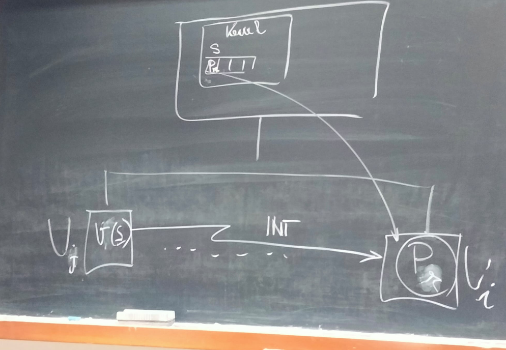

U_n = unità di elaborazione indipendenti
    M_n     = memoria privata
    I/O_n   = unità di I/O privata

Due modelli:
    
#### Modello SMP(Simmetric Multi Processing)
__Unica copia del nucleo__ condivisa tra tutte le CPU __allocata nella memoria comune__ che si occupa della gestione di tutte le risorse disponibili, comprese le CPU.

Caratteristiche:
- Ogni processo può essere __allocato su una qualunque CPU__
    - possibilità di politiche di bilanciamento di carico
    - più spesso si schedula un processo sul processare in cui stava eseguendo precedentemente in quanto quel processore ha già la sua memoria privata e le sue cache cariche con i dati di quel processo.
- E’ possibile che processi che eseguono su CPU diverse richiedano contemporaneamente funzioni del nucleo (es. System Call)
    - poichè, in generale, ogni funzione comporta un accesso alle strutture dati interne al nucleo, occorre fare in modo che gli __accessi al nucleo avvengano in modo sincronizzato__. Si ha quindi competizione tra CPU nell'esecuzione delle funzionalità del nucleo → necessità di sincronizzazione
    - per garantire sincronizzazione si può adattare una soluzione ad un solo lock, o meglio una soluzione con più lock che permette un maggior grado di parallelismo distinguendo le diverse classi di sezioni critiche associate alle varie strutture dati del kernel(coda dei processi pronti, singoli semafori, ...).

#### Modello a nuclei distinti
In questo modello la struttura interna del sistema operativo è articolata su più nuclei, ognuno dedicato alla gestione di una diversa CPU.
- più istanze del nucleo concorrenti caricate nella memoria privata dei vari nodi
- non c'è necessità di sincronizzazione, ogni processo ha il suo nucleo personale con le sue strutture dati
- Solo le interazioni tra processi appartenenti a nodi diversi utilizzano la memoria comune.
- i processi devono però venire schedulati sempre sullo stesso nodo dato che solamente li trovano le loro strutture dati del relativo kernel 

__OSS__: Questo modello offre una maggiore scalabilità rispetto al modello SMP in quanto all'aumentare del numero dei nodi il grado di sincronizzazione necessario rimane fisso (ogni nodo ha il proprio kernel privato -> no lock!). Lo stesso non vale per il modello SMP in cui, superato un certo numero di nodi, potrebbe verificarsi una sequenzializzazione degli accessi al kernel dati i troppi nodi che richiedono operazioni sulle stesse strutture dati dell'unico nucleo.

Il modello a nuclei distinti però richiede più risorse.

## Realizzazione dei semafori nel modello SMP
Tutte le CPU condividono lo stesso nucleo: per sincronizzare gli accessi al nucleo, le struttura dati del nucleo vengono protette tramite lock.

In particolare:
- i singoli semafori
- la coda dei processi pronti
vengono protetti tramite __lock distinti__.

In questo caso due operazioni P su semafori diversi
- possono operare in modo contemporaneo se non risultano sospensive.
- In caso contrario, vengono sequenzializzati solo gli accessi alla coda dei processi pronti.

#### Esempio: scheduling pre-emptive basato su priorità 
L'esecuzione della V può portare al cambio di contesto tra il processo risvegliato (Pr) e uno tra i processi in esecuzione (Pi), se la priorità di Pr è più alta della priorità di Pi. In questo caso il nucleo deve provvedere a revocare l'unità di elaborazione al processo Pi con priorità più bassa ed assegnarla al processo Pr riattivato dalla V.

- Occorre che il nucleo mantenga l'informazione del processo in esecuzione a più bassa priorità e del nodo fisico su cui opera.
- Inoltre è necessario un meccanismo di segnalazione tra le unità di elaborazione (ogni core può venire interrotto in maniera indipendente).

Siano:
- sem un semaforo, sul quale assumiamo sia inizialmente sospeso un processo (Pj)
- Pi il processo che esegue la V(sem) eseguendo sul nodo Ui
- Pj il processo riattivato per effetto della V(sem)
- Pk il processo a più bassa priorità che esegue su Uk

1. Pi chiama V(sem): Il nucleo, __attualmente eseguito da Ui__ con la funzione V(sem), invia un segnale di interruzione a Uk.
    - il core Ui risveglia un processo e deve quindi capire a quale core inviare un interruzione 
2. Uk gestisce l’interruzione utilizzando le funzioni del nucleo: inserisce Pk nella coda dei processi pronti e mette in esecuzione il processo Pj.
    - il core Uk deve effettuare un cambio di contesto

__In conclusione__: L'unica cosa che cambia rispetto al caso monoprocessore è che l'accesso alle strutture dati del nucleo deve avvenire in mutua esclusione (utilizzo di locke per ogni classe di sezione critica) e che una v può attivare preemption su uno qualsiasi dei vari nodi. 

## Realizzazione dei semafori nel modello a nuclei distinti
Solo le interazioni tra processi appartenenti a __nodi virtuali diversi__ utilizzano la memoria comune.

Distinzione tra:
- __Semafori privati__ di un nodo U: cioè utilizzati da processi appartenenti al nodo virtuale U.
    - Poichè hanno visibilità confinata al nodo U, vengono realizzati __come nel caso monoprocessore__.
- __Semafori condivisi__ tra nodi: cioè utilizzati da processi appartenenti a nodi virtuali differenti.

La __memoria comune__ deve contenere tutte le informazioni relative ai semafori condivisi.

#### Realizzazione dei semafori condivisi
Ogni semaforo condiviso viene rappresentato nella __memoria comune__ da un intero non negativo; l'accesso al semaforo sarà protetto da un lock x,
anch’esso memorizzato in memoria comune.

Inoltre, sempre nella memoria comune, nuova struttura dati: __Rappresentate del processo__!

Identifica in modo univoco un processo appartenente al sistema (multiprocessore)
- traccia sia il nodo in cui esegue
- che il PID del descrittore contenuto nella memoria privata del processore
- una sorta di coordinate del processo all'interno del sistema
    - __NB__: il descrittore di un processo, nel modello a nuclei distinti, ha un campo d'azione ristretto al nodo in cui è presente (memoria privata) 

Per ogni semaforo condiviso S vengono mantenute varie code:
- Su ogni nodo Ui: una __coda locale__ a Ui contenente i descrittori dei processi locali sospesi sul semaforo condiviso S
    - La coda risiede nella memoria privata del nodo e viene gestita esclusivamente dal nucleo del nodo.
- Una __coda globale dei rappresentanti__ di tutti i processi sospesi su S, accessibile da ogni nucleo.

#### Esecuzione di una P sospensiva su un semaforo S (ValS=0) condiviso:
Il nucleo del nodo Ui sul quale opera il processo Pk che ha chiamato la P(s), aggirna sia la coda globale che quella locale. Provvede a:
- inserire il rappresentante di Pk nella coda globale dei rappresentanti associata a S.
- inserire il descrittore di Pi nella coda locale a Ui associata a S.

#### Esecuzione di una V su un semaforo S (con rappresentanti in coda):
Assumendo che la V(S) sia chiamata dal processo Ph appartenente al nodo Uj:
1. Viene verificata le coda dei rappresentanti di S: il primo elemento è il rappresentante del processo Pk che appartiene al nodo Ui, che viene eliminato dalla coda.
2. Il nucleo di Uj (nodo che ha chiamato la v) provvede a comunicare tempestivamente l'identità del processo Pk risvegliato al nucleo di Ui (nodo che ha sospeso Pk);
3. Il nucleo di Ui provvede a riattivare il processo Pk, estraendo il suo descrittore dalla coda locale

__NB__: Durante il risveglio di un processo c'è bisogno di una __comunicazione tra nuclei di nodi diversi__, in quanto il nucleo del nodo su cui è stata invocata la v non contiene il descrittore del processo da risvegliare. Solo il kernel che ha sospeso il processo lo può anche risvegliare.

La comunicazione tra i nodi avviene tramite un interrupt. Il nucleo di Uj gestisce l’interruzione accedendo a un __buffer in memoria comune__ dove Ui ha preventivamente scritto il pid del processo da risvegliare (Pk) e quindi estrae il descrittore di Pk dalla coda locale di S, portando il processo risvegliato nello stato ready.