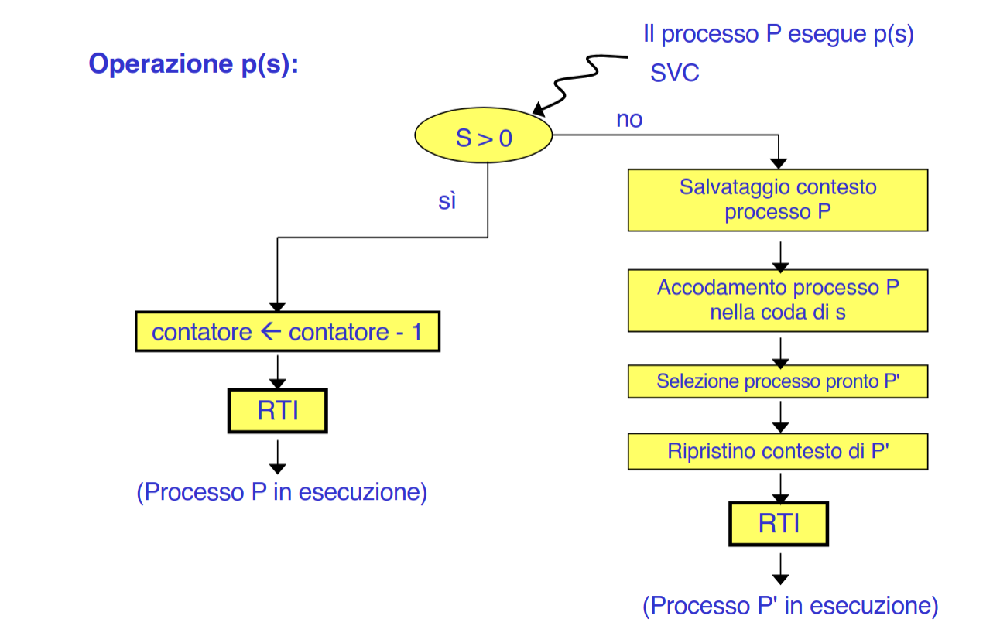

bla blah

Interessante: la p e la v di un semaforo provocano degli interrupt -> sono system call
- prevedibile, d'altronde attivano i meccanismi del kernel di sospensione/risveglio dei processi e modificano strutture dati del kernel.

### Semafori e Scheduler
__Ricorda__: Esistono una o più (caso di scheduling con priorità) code di processi pronti. Quando un processo e` riattivato per effetto di una v, viene inserito al fondo della coda corrispondente alla sua priorità.

Nel nucleo di un sistema monoprocessore il semaforo può essere implementato con:
- una variabile intera che rappresenta il suo valore(>=0)
- più una coda di descrittori dei processi in attesa sul semaforo (bloccati)

La coda viene gestita con politica FIFO: i processi risultano ordinati nel loro risveglio secondo il loro tempo di arrivo nella coda associata al semaforo. Il descrittore di un processo viene inserito nella coda del semaforo come conseguenza di una primitiva p non passante; viene prelevato per effetto di una v.

#### operazione p
Una p sospensiva inserisce il processo che ha chiamato la p nella coda dei processi sospesi sul semaforo, e causa il recupero e attivazione del processo più prioritario dalla coda dei processi pronti di sistema.

#### operazione v
Una v su una semaforo con coda non vuota, provoca l'estrazione del primo descrittore dalla coda del semaforo, e un successivo inserimento del descrittore estratto nella coda dei processi pronti di sistema.

Nel caso di un sistema che fa pre-emption, il processo che ha chiamato la v potrebbe ritrovarsi sostituito da quello appena risvegliato dalla coda del semaforo, se quest'ultimo ha priorità maggiore.

__In conclusione__: i semafori dipendono fortemente dallo scheduler e dalle sue strutture dati (code dei processi pronti). Il risveglio di un processo sospeso su un semaforo non provoca necessariamente un cambio di contesto, piuttosto, si ha un semplice inserimento del processo risvegliato nella coda dei processi pronti.