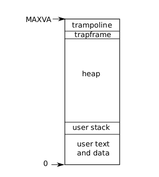

The unit of isolation in xv6 (as in other Unix operating systems) is a process. 

    The process abstraction prevents one process from wrecking or spying on another process’s memory, CPU, file descriptors, etc.

It also prevents a process from wrecking the kernel itself, so that a process can’t subvert the kernel’s isolation mechanisms. The kernel must implement the process abstraction with care because a buggy or malicious application may trick the kernel or hardware into doing something bad (e.g., circumventing isolation).

The mechanisms used by the kernel to implement processes include the __user/supervisor mode flag__, __address spaces__, and __time-slicing of threads__.

To help enforce isolation, the process abstraction provides the illusion to a program that it has its __own private machine__. A process provides a program with what appears to be a private memory system, or __address space__, which other processes cannot read or write. A process also provides the
program with what appears to be its __own CPU to execute the program’s instructions__.

### Address spaces
Xv6 uses page tables (which are implemented by hardware) to give each process its own address space. The RISC-V page table translates a virtual address  to a physical address. 

Xv6 maintains a separate page table for each process, this unique page table defines that process's address space. An address space includes the process’s user memory starting at virtual address zero. Instructions come first, followed by global variables, then the stack, and finally a “heap” area (for malloc) that the process can expand as needed.

There are a number of factors that limit the maximum size of a process’s address space: 
- pointers on the RISC-V are 64 bits wide;
- the hardware uses only the low 39 bits when looking up virtual addresses in page tables;
- and xv6 uses only 38 of those 39 bits. 
Thus, the maximum address is 2^38 − 1 = 0x3fffffffff, which is _MAXVA_.

At the top of the address space xv6 places a __trampoline page__ (4096 bytes) and a __trapframe page__.

    Xv6 uses these two pages to transition into the kernel and back

- The trampoline page contains the code to transition in and out of the kernel
- the trapframe is where the kernel saves the process’s user registers, as Chapter 4 explains.

### Threads
The xv6 kernel maintains many pieces of __state__ for each process, which it gathers into _struct proc_ (kernel/proc.h:85) . A process’s most important pieces of kernel state are its page table, its kernel stack, and its run state.

Each process has a thread of control (or thread for short) that holds the __state needed to execute the process__. At any given time, a thread might be executing on a CPU, or suspended (not executing, but capable of resuming executing in the future). To switch a CPU between processes, the kernel suspends the thread currently running on that CPU and saves its state, and restores the state of another process’s previously-suspended thread.

Much of the state of a thread (local variables, function call return addresses) is stored on the thread’s stacks (notare il plurale). __Each process has two stacks__: a user stack and a kernel stack ( p->kstack ). When the process is executing user instructions, only its user stack is in use, and its kernel stack is empty. When the process enters the kernel (for a system call or interrupt), the kernel code executes on the process’s kernel stack; while a process is in the kernel, its user stack still contains saved data, but isn’t actively used. A process’s thread alternates between actively using its user stack and its kernel stack. The kernel stack is separate (and protected from user code) so that the kernel can execute even if a process has wrecked its user stack.

**A process can make a system call by executing the RISC-V _ecall_ instruction**. This instruction raises the hardware privilege level and __changes the program counter to a kernel-defined entry point__. The code at the entry point __switches to the process’s kernel stack__ and executes the kernel instructions that implement the system call. When the system call completes, the kernel switches back to the user stack and returns to user space by calling the _sret_ instruction, which lowers the hardware privilege level and resumes executing user instructions just after the system call instruction. 

OSS: A process’s thread can “block” in the kernel to wait for I/O, and resume where it left off when the I/O has finished.

### Un paio di campi di proc
- p->state indicates whether the process is allocated, ready to run, currently running on a CPU, waiting for I/O, or exiting.
- p->pagetable holds the process’s page table, in the format that the RISC-V hardware ex- pects. Xv6 causes the paging hardware to use a process’s p->pagetable when executing that process in user space. A process’s page table also serves as the record of the addresses of the physical pages allocated to store the process’s memory.

### Conclusione
In summary, a process bundles two design ideas: 
- an address space to give a process the illusion of its own memory
- and a thread to give the process the illusion of its own CPU.

NB: In xv6, a process consists of one address space and one thread. In real operating systems a process may have more than one thread to take advantage of multiple CPUs.