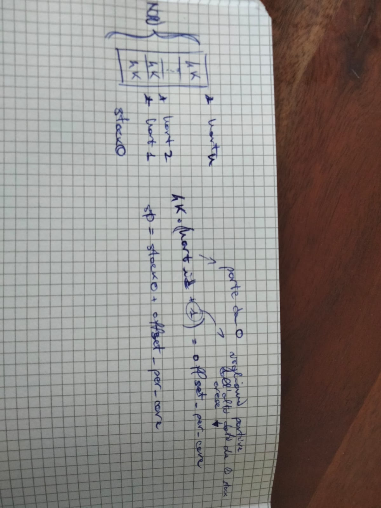

When the RISC-V computer powers on, it initializes itself and runs a boot loader which is stored in read-only memory. __The boot loader loads the xv6 kernel into memory__. Then, __in machine mode__, the CPU executes xv6 starting at _\_entry_ (kernel/entry.S:7). 

NB: tutti i core eseguono quello che c'è in _\_entry_ma anche quello che c'è in _start.c_ è possibile differenziare il comportamento del codice tra i core mediante l'__hartid__.
NB_2: The RISC-V computer starts with __paging hardware disabled__: virtual addresses map directly to physical addresses.

### Entry
The loader loads the xv6 kernel into memory at physical address __0x80000000__. The reason it places the kernel at 0x80000000 rather than 0x0 is because __the address range 0x0:0x80000000 contains I/O devices__.

__The instructions at _\_entry_ set up a stack so that xv6 can run C code__. Xv6 declares space for an initial stack, _stack0_ , in the file start.c (kernel/start.c:11) nel seguente modo: 

    // entry.S needs one stack per CPU.
    __attribute__ ((aligned (16))) char stack0[4096 * NCPU];

The code at _\_entry_ loads the stack pointer register _sp_ with the address _stack0+4096_ (se si ha solo un core), the top of the stack, because __the stack on RISC-V grows down__. 

### Stack setup con più core

__NB__: When the bootloader loads the kernel into memory, it loads the entire binary image, which includes all initialized global variables and any statically allocated memory. This means that when control is transferred to the kernel at _\_entry_, the memory allocated for _stack0_ is already present in physical memory, even though _entry.S_ is the first assembly code that actually executes (guarda _kernel.sym_ per vedere tutti i simboli disponibili dopo la compilazione).

### Start
Now that the kernel has a stack, _\_entry_ calls into C code at start (kernel/start.c:15). The function start performs some configuration that is only allowed in machine mode, and then switches to supervisor mode. To enter supervisor mode, RISC-V provides the instruction __mret__. This instruction is most often used to return from a previous call from supervisor mode to machine mode. _start_ isn’t returning from such a call (start non è stata chiamata da una funzione in supervisor mode), but sets things up as if it were:
- it sets the previous privilege mode to supervisor in the register __mstatus__
- it sets the return address to main by writing main’s address into the register __mepc__
- it disables virtual address translation in supervisor mode by writing 0 into the page-table register __satp__
    - Una volta passati in supervisor mode, e dopo l'inizializzazione del kernel e delle sue strutture dati, la traduzione degli indirizzi virtuali verrà abilitata in modo permanente.
- and delegates all interrupts and exceptions to supervisor mode (instead of machine mode).

Before jumping into supervisor mode, start performs one more task: __it programs the clock chip to generate timer interrupts__. With this housekeeping out of the way, _start_ “returns” to supervisor mode by calling _mret_. This causes the program counter to change to _main_ (kernel/main.c:11), the address previously stored in __mepc__.

### Main and init process
After _main_ (kernel/main.c:11) initializes several devices and subsystems, it creates the __first user process__ by calling _userinit_ (kernel/proc.c:233). 

The first process executes a small program written in RISC-V assembly, which makes __the first system call in xv6__. _initcode.S_ (user/initcode.S:3) loads the number for the _exec_ system call, _SYS_EXEC_ (kernel/syscall.h:8), into register a7, and then calls _ecall_ to re-enter the kernel (ricorda che _ecall_ è l'istruzione ISA che serve per invocare una system call, cambiando il privilegio corrente e saltando all'handler nello spazio del kernel; vedi "_Process overview.md_").

The kernel uses the number in register a7 in _syscall_ (kernel/syscall.c:132) to call the desired system call. The system call table (kernel/syscall.c:107) maps SYS_EXEC to the function sys_exec, which the kernel invokes. As we saw in Chapter 1, exec replaces the memory and registers of the current process with a new program (in this case, /init ).

Once the kernel has completed _exec_, it returns to user space in the _/init_ process. __init__ (user/init.c:15) creates a new console device file if needed and then opens it as file descriptors 0, 1, and 2. Then it starts a shell on the console. The system is up!