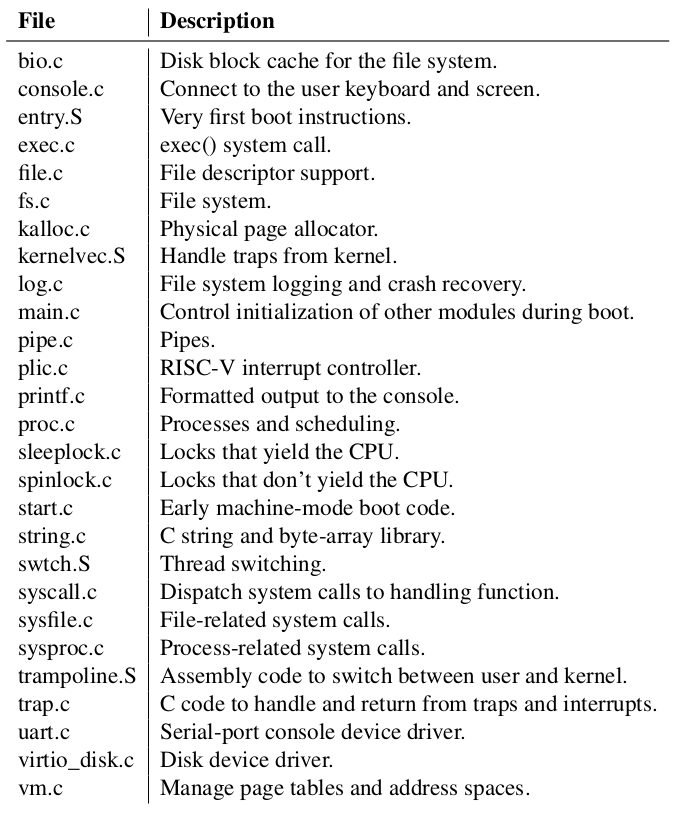

### Monolithic kernels
A key design question is what part of the operating system should run in supervisor mode. One possibility is that the entire operating system resides in the kernel, so that the implementations of all system calls run in supervisor mode. This organization is called a __monolithic kernel__.

In this organization the entire operating system consists of a single program running with full hardware privilege. This organization is convenient because the OS designer doesn’t have to decide which parts of the operating system don’t need full hardware privilege. Furthermore, it is easier for different parts of the operating system to cooperate. For example, an operating system might have a buffer cache that can be shared both by the file system and the virtual memory system.

A downside of the monolithic organization is that the interactions among different parts of the operating system are often complex (as we will see in the rest of this text), and therefore it is easy for an operating system developer to make a __mistake__.

NB: In a monolithic kernel, a mistake is fatal, because an error in supervisor mode will often cause the kernel to fail. If the kernel fails, the computer stops working, and thus all applications fail too. The computer must reboot to start again.

### Microkernels
To reduce the risk of mistakes in the kernel, OS designers can minimize the amount of operating system code that runs in supervisor mode, and execute the bulk of the operating system in user mode. This kernel organization is called a __microkernel__.

In a microkernel, the kernel interface consists of a few low-level functions for starting applications, sending messages, accessing device hardware, etc. This organization allows the kernel to be relatively simple, as most of the operating system resides in user-level servers (OS services running as processes are called servers).

### Dibattito
There is much debate among developers of operating systems about which organization is better, and there is no conclusive evidence one way or the other. Furthermore, it depends much on what “better” means: faster performance, smaller code size, reliability of the kernel, reliability of the complete operating system (including user-level services), etc.

There are also practical considerations that may be more important than the question of which organization. Some operating systems have a microkernel but run some of the user-level services in kernel space for performance reasons. Some operating systems have monolithic kernels because that is how they started and there is little incentive to move to a pure microkernel organization, because new features may be more important than rewriting the existing operating system to fit a microkernel design.

From this book’s perspective, microkernel and monolithic operating systems share many key ideas. They implement system calls, they use page tables, they handle interrupts, they support processes, they use locks for concurrency control, they implement a file system, etc. __This book focuses on these core ideas__.

### Architettura kernel xv6
Xv6 is implemented as a monolithic kernel, like most Unix operating systems. Thus, the xv6 kernel interface corresponds to the operating system interface, and the kernel implements the complete operating system. Since xv6 doesn’t provide many services, its kernel is smaller than some microkernels, but conceptually xv6 is monolithic.

### Organizzazione kernel xv6
 

The inter-module interfaces are defined in _kernel/defs.h_ .