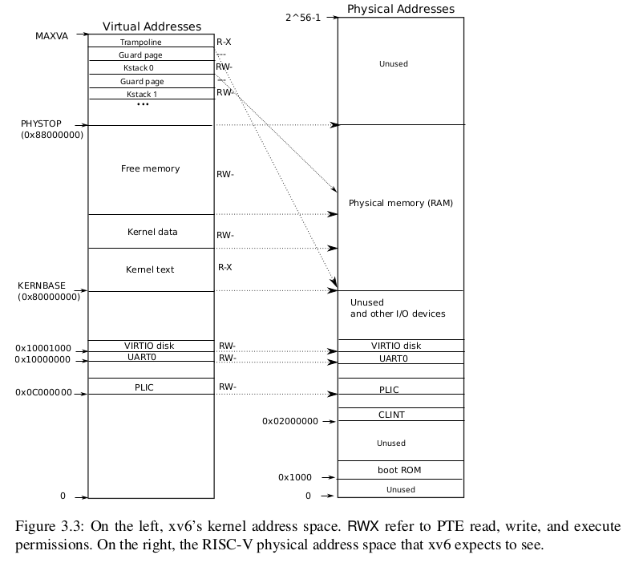

Xv6 maintains __one page table per process__, describing each process’s user address space, plus a __single page table that describes the kernel’s address space__. 

The kernel configures the layout of its address space to give itself access to physical memory and various hardware resources at predictable virtual addresses. Figure 3.3 shows how this layout maps kernel virtual addresses to physical addresses. The file (_kernel/memlayout.h_) declares the constants for xv6’s kernel memory layout.

QEMU simulates a computer that includes RAM (physical memory) starting at physical address 0x80000000 and continuing through at least 0x88000000, which xv6 calls PHYSTOP (in totale 128MiB di RAM). The QEMU simulation also includes __I/O devices__ such as a disk interface. QEMU exposes the device interfaces to software as __memory-mapped control registers that sit below 0x80000000 in the physical address space__. The kernel can interact with the devices by reading/writing these special physical addresses; such reads and writes communicate with the device hardware rather than with RAM. Chapter 4 explains how xv6 interacts with devices.

#### Direct mapping
The kernel gets at RAM and memory-mapped device registers using “__direct mapping__”; that is, mapping the resources at virtual addresses that are equal to the physical address. For example, the kernel itself is located at KERNBASE=0x80000000 in both the virtual address space and in physical memory. __Direct mapping simplifies kernel code that reads or writes physical memory__.

For example, when fork allocates user memory for the child process, __the allocator returns the physical address of that memory__; fork uses uses that address directly as a virtual address when it is copying the parent’s user memory to the child.

There are a couple of kernel virtual addresses that aren’t direct-mapped:
- __The trampoline page__. It is mapped at the top of the virtual address space; __user page tables have this same mapping__. Chapter 4 discusses the role of the trampoline page, but we see here an interesting use case of page tables; a physical page (holding the trampoline code) is __mapped twice in the virtual address space of the kernel__: once at top of the virtual address space and once with a direct mapping.

- __The kernel stack pages__. Each process has its own kernel stack, which is mapped high so that below it xv6 can leave an unmapped __guard page__. The guard page’s PTE is invalid (i.e., PTE_V is not set), so that __if the kernel overflows a kernel stack, it will likely cause an exception__ and the kernel will panic. Without a guard page an overflowing stack would overwrite other kernel memory, resulting in incorrect operation. A panic crash is preferable.

__OSS__: While the kernel uses its stacks via the high-memory mappings, they are also accessible to the kernel through a direct-mapped address. An alternate design might have just the direct mapping, and use the stacks at the direct-mapped address. In that arrangement, however, providing guard pages would involve unmapping virtual addresses that would otherwise refer to physical memory, which would then be hard to use.

The kernel maps the pages for the trampoline and the kernel text with the permissions PTE_R and PTE_X . The kernel reads and executes instructions from these pages. The kernel maps the other pages with the permissions PTE_R and PTE_W , so that it can read and write the memory in those pages. The mappings for the guard pages are invalid.