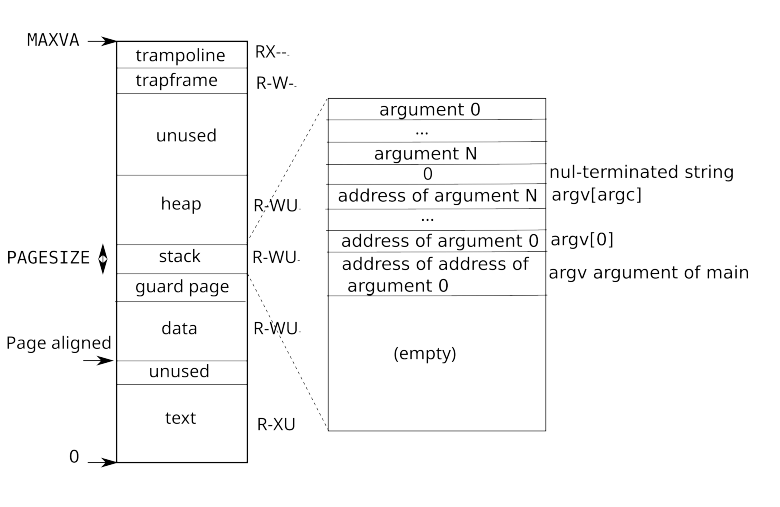

Each process has its own page table, and when xv6 switches between processes, it also changes page tables. A process’s user memory starts at virtual address zero and can grow up to MAXVA (kernel/riscv.h:375) , allowing a process to address in principle 256 Gigabytes of memory.

A process’s address space consists of pages that contain the __text of the program__ (which xv6 maps with the permissions PTE_R , PTE_X , and PTE_U ), pages that contain the __pre-initialized data
of the program__, a page for the __stack__ (notare il singolare), and pages (notare il plrale) for the __heap__. Xv6 maps the data, stack, and heap with the permissions PTE_R , PTE_W , and PTE_U.

#### Stack
The stack is a single page, and is shown with the __initial contents as created by exec__(vedi apposito file). Strings containing the command-line arguments, as well as an array of pointers to them, are at the very top of the stack. Just under that are values that allow a program to start at main as if the function main(argc, argv) had just been called.

To detect a user stack overflowing the allocated stack memory, xv6 places an inaccessible guard page right below the stack by clearing the PTE_U flag. If the user stack overflows and the process tries to use an address below the stack, the hardware will generate a page-fault exception because the guard page is inaccessible to a program running in user mode.

A real-world operating system might instead automatically allocate more memory for the user stack when it overflows.

When a process asks xv6 for more user memory, xv6 grows the process’s heap. Xv6 first uses kalloc to allocate physical pages. It then adds PTEs to the process’s page table that point to the new physical pages. Xv6 sets the PTE_W , PTE_R , PTE_U , and PTE_V flags in these PTEs. Most processes do not use the entire user address space; xv6 leaves PTE_V clear in unused PTEs.

We see here a few nice examples of use of page tables. First, different processes’ page tables translate user addresses to different pages of physical memory, so that each process has __private user memory__. Second, each process sees its memory as having contiguous virtual addresses starting at zero, while the process’s physical memory can be non-contiguous. __Third__, the kernel maps a page with __trampoline__ code at the top of the user address space (without PTE_U ), thus a single page of physical memory shows up in all address spaces, but can be used only by the kernel.

#### Permessi all'interno dello spazio di indirizzamento
Using permissions within a user address space is a common technique to harden a user process. If the text were mapped with PTE_W, then a process could accidentally modify its own program; for example, a programming error may cause the program to write to a null pointer, modifying instructions at address 0, and then continue running, perhaps creating more havoc. 

To detect such errors immediately, xv6 maps the text without PTE_W ; if a program accidentally attempts to store to address 0, the hardware will refuse to execute the store and raises a page fault (see Section 4.6). The kernel then kills the process and prints out an informative message so that the developer can track down the problem. Similarly, by mapping data without PTE_X , a user program cannot accidentally jump to an address in the program’s data and start executing at that address.

In the real world, hardening a process by setting permissions carefully also aids in defending against security attacks. An adversary may feed carefully-constructed input to a program (e.g., a Web server) that triggers a bug in the program in the hope of turning that bug into an exploit [14]. Setting permissions carefully and other techniques, such as __randomizing of the layout of the user address space__, make such attacks harder.
