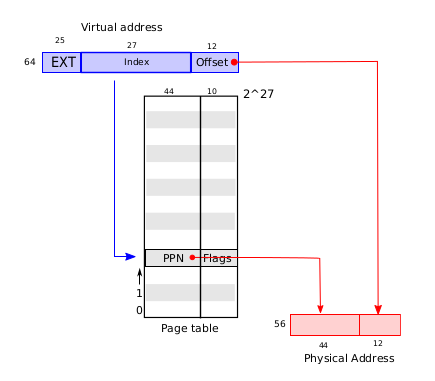
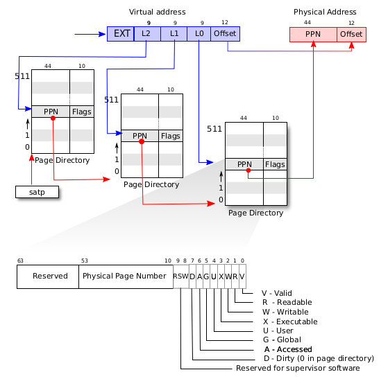

Page tables are the most popular mechanism through which the operating system provides each process with its own __private address space and memory__. Page tables determine what memory addresses mean, and what parts of physical memory can be accessed. They allow xv6 to isolate different process’s address spaces and to multiplex them onto a single physical memory. 

Page tables are a popular design because they provide a level of indirection that allow operating systems to perform many __tricks__. Xv6 performs a few tricks: mapping the same memory (a trampoline page) in several address spaces, and guarding kernel and user stacks with an unmapped page.

### Paging hardware
As a reminder, RISC-V instructions (both user and kernel) manipulate virtual addresses. The machine’s RAM, or physical memory, is indexed with physical addresses. The RISC-V page table hardware connects these two kinds of addresses, by mapping each virtual address to a physical address.

Xv6 runs on Sv39 RISC-V, which means that __only the bottom 39 bits of a 64-bit virtual address are used__; the top 25 bits are not used. In this Sv39 configuration, a RISC-V page table is __logically__ an array of 2^27 (pagine da 4k bytes -> 12 bit) __page table entries__ (PTEs). Each PTE contains a 44-bit __physical page number__ (PPN), utilizzato per indicizzare fisicamente: le page table pages del prossimo livello, oppure le pagine contenenti la memoria fisica mappato all'indirizzo virtuale, and some flags. The paging hardware translates a virtual address by using the top 27 bits of the 39 bits (of the virtual address) to index into the page table to find a PTE, and making a __56-bit physical address__(gli indirizzi fisici sono invece da 56 bit) whose top 44 bits come from the PPN in the PTE and whose bottom 12 bits are copied from the original virtual address (l'offset di pagina rimane uguale).

A page table gives the operating system control over virtual-to-physical address translations at the granularity of aligned chunks of 4096 (2^12) bytes. Such a chunk is called a page.

Curiosità: questi numeri di bit sono stati scelti dai designer di RISC-V basandosi su predizioni. 

Passando dalla visione logica della page table a quella reale, si ha quanto mostrato di seguito.

A RISC-V CPU translates a virtual address into a physical one in __three steps__. A page table is stored in __physical memory__ as a __three-level tree__. The root of the tree is a 4096-byte page-table __page__ that contains 512 PTEs, which contain the physical addresses for page-table pages (notare il plurale, ogni entry nella prima table punta ad una ulteriore table) in the next level of the tree. Each of those pages contains 512 PTEs for the final level in the tree.

The paging hardware uses the top 9 bits of the 27 bits to select a PTE in the root page-table page, the middle 9 bits to select a PTE in a page-table page in the next level of the tree, and the bottom 9 bits to select the final PTE. If any of the three PTEs required to translate an address is not present, the paging hardware raises a _page-fault exception_, leaving it up to the kernel to handle the exception (see Chapter 4).

#### Perchè paginazione a livelli?
The three-level structure of Figure 3.2 allows a __memory-efficient way of recording PTEs__, compared to the single-level design of Figure 3.1. In the common case in which large ranges of virtual addresses have no mappings, __the three-level structure can omit entire page directories__. For example, if an application uses only a few pages starting at address zero, then the entries 1 through 511 of the top-level page directory are invalid, and __the kernel doesn’t have to allocate pages those for 511 intermediate page directories__. Furthermore, the kernel also doesn’t have to allocate pages for the bottom-level page directories for those 511 intermediate page directories. So, in this example, the three-level design saves 511 pages for intermediate page directories and 511 × 512 pages for bottom-level page directories (chiaramente la top-level directory è un'unica pagina e quindi il kernel la deve allocare nella sua interezza).

From the kernel’s point of view, a page table is data stored in memory, and the kernel creates and modifies page tables using code much like you might see for any tree-shaped data structure.

#### TLB
Although a CPU walks the three-level structure in hardware as part of executing a load or store instruction, a potential downside of three levels is that the CPU must load three PTEs from memory to perform the translation of the virtual address in the load/store instruction to a physical address (accessi alla lenta memoria mutlipli per ogni load/store). To avoid the cost of loading PTEs from physical memory, __a RISC-V CPU caches page table entries__ (a quanto pare non direttamente le pagine, bisogna fare quindi un'accesso alla memoria? forse ci pensano le altre cache) in a __Translation Look-aside Buffer__ (TLB).

Each RISC-V CPU caches page table entries in a TLB, and __when xv6 changes a page table__, it must tell the CPU to invalidate corresponding cached TLB
entries. If it didn’t, then at some point later the TLB might use an old cached mapping, pointing to a physical page that in the meantime has been allocated to another process, and as a result, a process might be able to scribble on some other process’s memory.

The RISC-V has an instruction _sfence.vma_ that flushes the current CPU’s TLB. Xv6 executes sfence.vma in kvminithart after reloading the satp register, and in the trampoline code that switches to a user page table before returning to user space (kernel/trampoline.S:89). xv6 non fa quindi una invalidazione minima della CPU ma è in grado solo di fare un flush globale.
- To avoid flushing the complete TLB, RISC-V CPUs may support address space identifiers (ASIDs) [3]. The kernel can then flush just the TLB entries for a particular address space. __Xv6 does not use this feature__.

It is also necessary to issue sfence.vma before changing satp, in order to wait for completion of all outstanding loads and stores. This wait ensures that preceding updates to the page table have completed, and ensures that preceding loads and stores use the old page table, not the new one. 

- Quando sfence.vma viene eseguito, __la CPU si assicura__ che tutti i carichi e le memorizzazioni in corso siano completati prima di permettere ulteriori operazioni di accesso alla memoria. Questo è importante per evitare che carichi o memorizzazioni in sospeso (iniziati con la vecchia tabella delle pagine) vengano completati usando una nuova traduzione, che potrebbe essere errata.
- In altre parole, il flush del TLB blocca il passaggio alla nuova tabella delle pagine fino a quando non sono terminati tutti gli accessi alla memoria che utilizzano la vecchia mappatura. In questo modo, si garantisce che non ci siano operazioni di memoria “miste” che usano traduzioni incoerenti.

#### Flags
Each PTE contains flag bits that tell the paging hardware how the associated virtual address is allowed to be used.
- PTE_V indicates whether the PTE is present: if it is not set, a reference to the page causes an exception (i.e., is not allowed).
- PTE_R controls whether instructions are allowed to read to the page.
- PTE_W controls whether instructions are allowed to write to the page.
- PTE_X controls whether the CPU may interpret the content of the page as instructions and execute them.
- PTE_U controls whether instructions in user mode are allowed to access the page; if PTE_U is not set, the PTE can be used only in supervisor mode.
- ...

The flags and all other page hardware-related structures are defined in (_kernel/riscv.h_).

#### SATP register
To tell a CPU to use a page table, __the kernel must write the physical address of the root page table page into the satp (Supervisor Address Translation and Protection) register__. A CPU will translate all addresses generated by subsequent instructions using the page table pointed to by its own satp. __Each CPU has its own satp__ so that different CPUs can run different processes, each with a private address space described by its own page table. A questo punto è anche evidente notare che quando si effettua un cambio di contesto, uno fra i vari registri da ripristinare per il nuovo processo a cui viene assegnata la CPU è proprio satp.  

### Terminologia
A few notes about terms used in this book:
- Physical memory refers to storage cells in RAM.
- A byte of physical memory has an address, called a physical address.
- Instructions that dereference addresses (such as loads, stores, jumps, and function calls) use only virtual addresses, which the paging hardware translates to physical addresses, and then sends to the RAM hardware to read or write storage.
- An address space is the set of virtual addresses that are valid in a given page table.
- Each xv6 process has a separate user address space, and __the xv6 kernel has its own address space__ as well.
- User memory refers to a process’s user address space plus the physical memory that the page table allows the process to access.
- Virtual memory refers to the ideas and techniques associated with managing page tables and using them to achieve goals such as isolation.