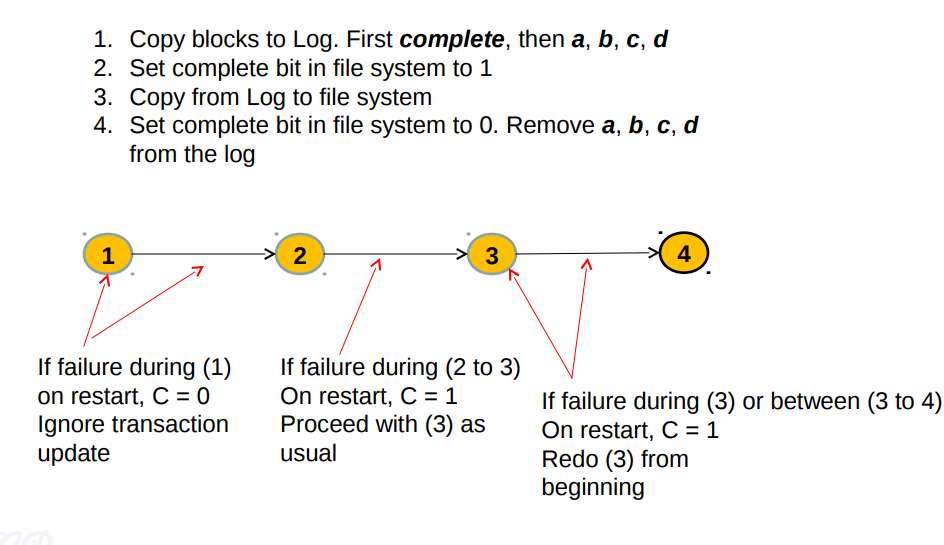

One of the most interesting problems in file system design is crash recovery. **The problem arises because many file-system operations involve multiple writes to the disk**, and a **crash after a subset** of the writes may leave the on-disk file system in an **inconsistent state**.
- notare che il problema riguarda solamente le **write**!

Xv6 solves the problem of crashes during file-system operations with a simple form of logging.

### How does it work?
An xv6 system call does NOT directly write the on-disk file system data structures. Instead,
1. **it places a description of all the disk writes it wishes to make in a log on the disk**.
2. Once the system call has logged all of its writes, **it writes a special commit record to the disk indicating that the log contains a complete operation**.
3. At that point, **the system call copies the writes to the on-disk file system data structures**.
4. After those writes have completed, **the system call erases the log on disk**.

If the system should crash and reboot, the file-system code recovers from the crash as follows, before running any processes.
- If the log is marked as **containing a complete operation**, then the recovery code **copies the writes** to where they belong in the on-disk file system.
- If the log is **NOT marked as containing a complete operation**, the recovery code **ignores the log**.
- The recovery code finishes by erasing the log.

In either case, the log makes operations atomic with respect to crashes: after recovery, either all of the operation’s writes appear on the disk, or none of them appear.




### Log design
The log resides at a known fixed location, specified in the superblock. 

The log consists of a **header block** followed by a sequence of **updated block copies** (“logged blocks”). **The header block contains an array of sector numbers, one for each of the logged blocks**, and the **count of log blocks**. The count in the header block on disk is either zero, indicating that there is no transaction in the log, or nonzero, indicating that the log contains a complete committed transaction with the indicated number of logged blocks. Xv6 writes the header block when a transaction commits, but not before, and sets the count to zero after copying the logged blocks to the file system. Thus a crash midway through a transaction will result in a count of zero in the log’s header block; a crash after a commit will result in a non-zero count

```C
// singolo blocco contenente il conteggio 
// e gli indici degli altri log block
struct logheader {
  int n;
  int block[LOGSIZE];   // questi sono i corrispettivi data blocks dei block presenti nel log
};
```

Each system call’s code indicates the start and end of the sequence of writes that must be atomic with respect to crashes. To allow **concurrent execution of file-system operations by different processes**, the logging system can **accumulate the writes of multiple system calls into one transaction**.  Thus a single commit may involve the writes of multiple complete system calls. To avoid splitting a system call (che ricordiamo può fare una serie di write) across transactions, **the logging system only commits when no file-system system calls are underway**.


Xv6 dedicates a **fixed amount of space on the disk to hold the log**. The total number of blocks written by the system calls in a transaction **must fit in that space**. This has two consequences:
- **No single system call can be allowed to write more distinct blocks than there is space in the log**.
    - This is not a problem for most system calls, but two of them can potentially write many blocks: write and unlink.
    - A large file write may write many data blocks and many bitmap blocks as well as an inode block; unlinking a large file might write many bitmap blocks and an inode. 
    - Xv6’s write system call **breaks up large writes into multiple smaller writes that fit in the log**, and unlink doesn’t cause problems because in practice the xv6 file system uses only one bitmap block.
- The logging system **cannot allow a system call to start unless it is certain that the system call’s writes will fit in the space remaining in the log**.
    - come detto prima, se una syscall parte la vogliamo anche far finire per non dividerla tra molteplici transazioni 