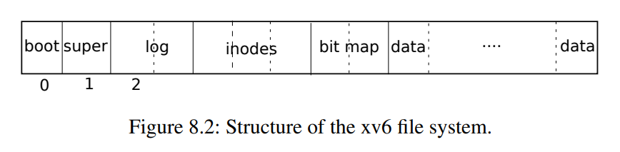

The purpose of a file system is to **organize and store data**. The xv6 file system provides Unix-like files, directories, and pathnames (see Chapter 1), and stores its data on a virtio disk for persistence.

The file system addresses **several challenges**:
- The file system needs **on-disk data structures** to represent:
    - the tree of named directories and files
    - to record the identities of the blocks that hold each file’s content
    - and to record which areas of the disk are free.
- The file system must support **crash recovery**.
- Different processes may operate on the file system at the same time, so the file-system code must coordinate to **maintain invariants**.
- Accessing a disk is orders of magnitude slower than accessing memory, so the file system must maintain an **in-memory cache of popular blocks**.  

### Layers of FS
The xv6 file system implementation is organized in **seven layers**:
1. The **disk layer** reads and writes blocks on an virtio hard drive.

2. The **buffer cache layer** caches disk blocks and synchronizes access to them.

3. The **logging layer** allows higher layers to wrap updates to several blocks in a transaction, and ensures that the blocks are updated atomically in the face of crashes (i.e., all of them are updated or none).

4. The **inode layer** provides individual files! Each represented as an inode with a unique i-number and some blocks holding the file’s data.

5. The **directory layer** implements each directory as a special kind of inode whose content is a sequence of directory entries, each of which contains a file’s name and i-number.

6. The **pathname layer** provides hierarchical path names like /usr/rtm/xv6/fs.c, and resolves them with recursive lookup.

7. The **file descriptor layer** abstracts many Unix resources (e.g., pipes, devices, files, etc.) using the file system fd interface, simplifying the lives of application programmers.

### Blocks
Disk hardware traditionally presents the **data on the disk as a numbered sequence of 512-byte blocks** (also called **sectors**): sector 0 is the first 512 bytes, sector 1 is the next, and so on.
- The block size that an operating system uses for its file system maybe different than the sector size that a disk uses, but typically the block size is a multiple of the sector size.

Xv6 holds **copies of blocks that it has read into memory** in objects of type **_struct buf_** (kernel/buf.h:1). 
- The data stored in this structure is sometimes out of sync with the disk

### Disk sections
The file system must have a plan for where it stores inodes (metadata blocks) and content blocks on the disk. To do so, xv6 divides the disk into several sections.

- The file system does not use block 0 (it holds the **boot sector**).

- Block 1 is called the **superblock**; it contains metadata about the file system
    - the file system size in blocks
    - the number of data blocks
    - the number of inodes
    - and the number of blocks in the log.
    - The superblock is filled in by a separate program, called _mkfs_, which builds an initial file system.

- Blocks starting at 2 hold the **log**. 

- After the log are the **inodes**
    - with multiple inodes per block.

- After those come **bitmap blocks** tracking which data blocks are in use.

- The remaining blocks are **data blocks**
    - each is either marked free in the bitmap block, or holds content for a file or directory.
    

